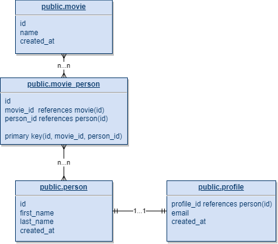

<p align="center">

</p>

<p align="center">
  
<a href="https://www.nuget.org/packages/postgrest-csharp/">
  
</a>
</p>

---

## Now supporting (many) LINQ expressions!

```c#
await client.Table<Movie>()
            .Select(x => new object[] { x.Id, x.Name, x.Tags, x.ReleaseDate })
            .Where(x => x.Tags.Contains("Action") || x.Tags.Contains("Adventure"))
            .Order(x => x.ReleaseDate, Ordering.Descending)
            .Get();

await client.Table<Movie>()
            .Set(x => x.WatchedAt, DateTime.Now)
            .Where(x => x.Id == "11111-22222-33333-44444")
            // Or .Filter(x => x.Id, Operator.Equals, "11111-22222-33333-44444")
            .Update();

```

---

Documentation can be found [here](https://supabase-community.github.io/postgrest-csharp/api/Postgrest.html).

Postgrest-csharp is written primarily as a helper library
for [supabase/supabase-csharp](https://github.com/supabase/supabase-csharp), however, it should be easy enough to use
outside of the supabase ecosystem.

The bulk of this library is a translation and c-sharp-ification of
the [supabase/postgrest-js](https://github.com/supabase/postgrest-js) library.

## Getting Started

Postgrest-csharp is _heavily_ dependent on Models deriving from `BaseModel`. To interact with the API, one must have the
associated
model specified.

To use this library on the Supabase Hosted service but separately from the `supabase-csharp`, you'll need to specify
your url and public key like so:

```c#
var auth = new Supabase.Gotrue.Client(new ClientOptions<Session>
{
    Url = "https://PROJECT_ID.supabase.co/auth/v1",
    Headers = new Dictionary<string, string>
    {
        { "apikey", SUPABASE_PUBLIC_KEY },
        { "Authorization", $"Bearer {SUPABASE_USER_TOKEN}" }
    }
})
```

Leverage `Table`,`PrimaryKey`, and `Column` attributes to specify names of classes/properties that are different from
their C# Versions.

```c#
[Table("messages")]
public class Message : BaseModel
{
    [PrimaryKey("id")]
    public int Id { get; set; }

    [Column("username")]
    public string UserName { get; set; }

    [Column("channel_id")]
    public int ChannelId { get; set; }

    public override bool Equals(object obj)
    {
        return obj is Message message &&
                Id == message.Id;
    }

    public override int GetHashCode()
    {
        return HashCode.Combine(Id);
    }
}
```

Utilizing the client is then just a matter of instantiating it and specifying the Model one is working with.

```c#
void Initialize()
{
    var client = new Client("http://localhost:3000");

    // Get All Messages
    var response = await client.Table<Message>().Get();
    List<Message> models = response.Models;

    // Insert
    var newMessage = new Message { UserName = "acupofjose", ChannelId = 1 };
    await client.Table<Message>().Insert();

    // Update
    var model = response.Models.First();
    model.UserName = "elrhomariyounes";
    await model.Update();

    // Delete
    await response.Models.Last().Delete();
}
```

## Foreign Keys, Join Tables, and Relationships

The Postgrest server does introspection on relationships between tables and supports returning query data from
tables with these included. **Foreign key constrains are required for postgrest to detect these relationships.**

This library implements the attribute, `Reference` to specify on a model when a relationship should be included in a
query.

- [One-to-one Relationships](https://postgrest.org/en/stable/api.html#one-to-one-relationships): One-to-one
  relationships are detected if there’s an unique constraint on a foreign key.
- [One-to-many Relationships](https://postgrest.org/en/stable/api.html#one-to-many-relationships): The inverse
  one-to-many relationship between two tables is detected based on the foreign key reference.
- [Many-to-many Relationships](https://postgrest.org/en/stable/api.html#many-to-many-relationships): Many-to-many
  relationships are detected based on the join table. The join table must contain foreign keys to other two tables and
  they must be part of its composite key.

Given the following schema:



We can define the following models:

```c#
[Table("movie")]
public class Movie : BaseModel
{
    [PrimaryKey("id")]
    public int Id { get; set; }

    [Column("name")]
    public string Name { get; set; }

    [Reference(typeof(Person))]
    public List<Person> Persons { get; set; }

    [Column("created_at")]
    public DateTime CreatedAt { get; set; }
}

[Table("person")]
public class Person : BaseModel
{
    [PrimaryKey("id")]
    public int Id { get; set; }

    [Column("first_name")]
    public string FirstName { get; set; }

    [Column("last_name")]
    public string LastName { get; set; }

    [Reference(typeof(Profile))]
    public Profile Profile { get; set; }

    [Column("created_at")]
    public DateTime CreatedAt { get; set; }
}

[Table("profile")]
public class Profile : BaseModel
{
    [Column("email")]
    public string Email { get; set; }
}
```

**Note that each related model should inherit `BaseModel` and specify its `Table` and `Column` attributes as usual.**

The `Reference` Attribute by default will include the referenced model in all GET queries on the table (this can be
disabled
in its constructor).

As such, a query on the `Movie` model (given the above) would return something like:

```js
[
    {
        id: 1,
        created_at: "2022-08-20T00:29:45.400188",
        name: "Top Gun: Maverick",
        person: [
            {
                id: 1,
                created_at: "2022-08-20T00:30:02.120528",
                first_name: "Tom",
                last_name: "Cruise",
                profile: {
                    profile_id: 1,
                    email: "tom.cruise@supabase.io",
                    created_at: "2022-08-20T00:30:33.72443"
                }
            },
            {
                id: 3,
                created_at: "2022-08-20T00:30:33.72443",
                first_name: "Bob",
                last_name: "Saggett",
                profile: {
                    profile_id: 3,
                    email: "bob.saggett@supabase.io",
                    created_at: "2022-08-20T00:30:33.72443"
                }
            }
        ]
    },
    // ...
]
```

### Circular References

Circular relations can be added between models, however, circular relations should only be parsed one level deep for
models. For example, given the
models [here](https://github.com/supabase-community/postgrest-csharp/blob/master/PostgrestTests/Models/LinkedModels.cs),
a raw response would look like the following (note that the `Person` object returns the root `Movie` and
the `Person->Profile` returns its root `Person` object).

If desired, this can be avoided by making specific join models that do not have the circular references.

```json
[
  {
    "id": "68722a22-6a6b-4410-a955-b4eb8ca7953f",
    "created_at": "0001-01-01T05:51:00",
    "name": "Supabase in Action",
    "person": [
      {
        "id": "6aa849d8-dd09-4932-bc6f-6fe3b585e87f",
        "first_name": "John",
        "last_name": "Doe",
        "created_at": "0001-01-01T05:51:00",
        "movie": [
          {
            "id": "68722a22-6a6b-4410-a955-b4eb8ca7953f",
            "name": "Supabase in Action",
            "created_at": "0001-01-01T05:51:00"
          }
        ],
        "profile": {
          "person_id": "6aa849d8-dd09-4932-bc6f-6fe3b585e87f",
          "email": "john.doe@email.com",
          "created_at": "0001-01-01T05:51:00",
          "person": {
            "id": "6aa849d8-dd09-4932-bc6f-6fe3b585e87f",
            "first_name": "John",
            "last_name": "Doe",
            "created_at": "0001-01-01T05:51:00"
          }
        }
      },
      {
        "id": "07abc67f-bf7d-4865-b2c0-76013dc2811f",
        "first_name": "Jane",
        "last_name": "Buck",
        "created_at": "0001-01-01T05:51:00",
        "movie": [
          {
            "id": "68722a22-6a6b-4410-a955-b4eb8ca7953f",
            "name": "Supabase in Action",
            "created_at": "0001-01-01T05:51:00"
          }
        ],
        "profile": {
          "person_id": "07abc67f-bf7d-4865-b2c0-76013dc2811f",
          "email": "jane.buck@email.com",
          "created_at": "0001-01-01T05:51:00",
          "person": {
            "id": "07abc67f-bf7d-4865-b2c0-76013dc2811f",
            "first_name": "Jane",
            "last_name": "Buck",
            "created_at": "0001-01-01T05:51:00"
          }
        }
      }
    ]
  }
]
```

### Top Level Filtering

**By default** relations expect to be used as top level filters on a query. If following the models above, this would
mean that a `Movie` with no `Person` relations on it would not return on a query **unless** the `Relation`
has `shouldFilterTopLevel` set to `false`:

The following model would return any movie, even if there are no `Person` models associated with it:

```c#
[Table("movie")]
public class Movie : BaseModel
{
    [PrimaryKey("id")] 
    public string Id { get; set; }

    [Column("name")] 
    public string? Name { get; set; }

    [Reference(typeof(Person), shouldFilterTopLevel: false)]
    public List<Person> People { get; set; } = new();
}
```

**Further Notes**:

- Postgrest _does not support nested inserts or upserts_. Relational keys on models will be ignored when attempting to
  insert or upsert on a root model.
- The `Relation` attribute uses reflection to only select the attributes specified on the Class Model (i.e.
  the `Profile` model has a property only for `email`, only the property will be requested in the query).

## Status

- [x] Connects to PostgREST Server
- [x] Authentication
- [x] Basic Query Features
    - [x] CRUD
    - [x] Single
    - [x] Range (to & from)
    - [x] Limit
    - [x] Limit w/ Foreign Key
    - [x] Offset
    - [x] Offset w/ Foreign Key
- [x] Advanced Query Features
    - [x] Filters
    - [x] Ordering
- [ ] Custom Serializers
    - [ ] [Postgres Range](https://www.postgresql.org/docs/9.3/rangetypes.html)
        - [x] `int4range`, `int8range`
        - [ ] `numrange`
        - [ ] `tsrange`, `tstzrange`, `daterange`
- [x] Models
    - [x] `BaseModel` to derive from
    - [x] Coercion of data into Models
- [x] Unit Testing
- [x] Nuget Package and Release

## Package made possible through the efforts of:

|  |  |
|:----------------------------------------------------------------------:|:---------------------------------------------------------------------------:|
|              [acupofjose](https://github.com/acupofjose)               |            [elrhomariyounes](https://github.com/elrhomariyounes)            |

## Contributing

We are more than happy to have contributions! Please submit a PR.
